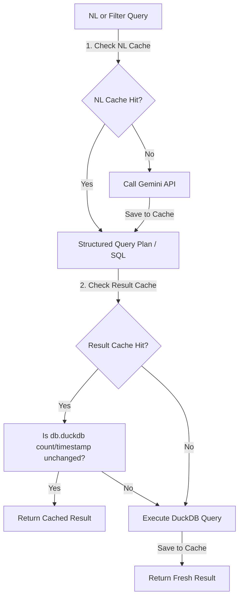

# Implementation Plan - Agent Trace Analytics Engine

Build a local full-stack analytics engine for AI agent traces, featuring a logging SDK, an ingestion API, a local DuckDB database (`db.duckdb`) with an optimized denormalized schema, a natural-language query interface, and a realistic simulator.

## User Review Required

> [!IMPORTANT]
> **Dashboard Chart Refresh Issue Identified:**
> The chart currently does not update when changing sidebar filters (e.g. from last 7 days to last hour). 
> 
> **Why this happens:**
> 1. In `apps/web/src/App.tsx`, the `useEffect` hook triggers when any filter state changes. However, it currently re-triggers `handlePresetClick('Number of runs per hour')` which resets the chart to the default query.
> 2. The preset click handler and the SQL approval handler make POST requests to `/api/query/run` with the raw SQL, but do not pass the active filters in the request body.
> 3. The frontend does not preserve the original base SQL query string before rewriting. If a user tries to query dynamically, the original structure is lost or bypassed.
> 
> **Proposed Fix:**
> 1. Introduce a new state `baseSql` to store the raw SQL translation.
> 2. Implement `refreshActiveQuery(sql)` to run the active query using the current filters.
> 3. Update the `useEffect` hook to call `refreshActiveQuery(baseSql)` if a query is active, and only fall back to the default preset query if `baseSql` is null (on initial render).
> 4. Modify `handlePresetClick` and `handleApproveSql` to save the raw SQL in `baseSql` and pass current filters to `/api/query/run`.

> [!WARNING]
> **KPI Cards Filtering Issue Identified:**
> The KPI metrics cards (Total Traces, Avg Latency, Error Rate, Total Cost) do not update when selecting sidebar filters.
> 
> **Why this happens:**
> The `/api/kpis` endpoint handler `getKpisHandler` in `apps/api/src/query.ts` executes a static, unfiltered query on the `events` table and ignores all request query parameters.
> 
> **Proposed Fix:**
> 1. Extract `agentName`, `status`, `model`, `toolName`, and `timeRange` from `req.query` in `getKpisHandler`.
> 2. Construct dynamic filter conditions and query parameter values (just like in `listTracesHandler`).
> 3. Apply the filters to the KPI SQL aggregation by wrapping the query in a `WHERE traceId IN (SELECT DISTINCT traceId FROM events <whereClause>)` subquery when filters are present.

> [!IMPORTANT]
> **Incorrect KPI Error Rate Calculation Formula:**
> The dashboard's KPI "Error Rate" displays a very high value (~75.9%) instead of the actual trace failure rate (~55.7%).
> 
> **Why this happens:**
> 1. The SQL query in `getKpisHandler` calculates the error rate using: `COUNT(DISTINCT CASE WHEN eventType = 'error' THEN traceId END) * 100.0 / NULLIF(COUNT(DISTINCT traceId), 0)`.
> 2. This counts any trace that contains *at least one event* of type `'error'`.
> 3. Under realistic agent simulations, traces often experience transient errors (such as tool rate limits) that are successfully retried, allowing the trace to eventually complete successfully (`status = 'success'`).
> 4. Classifying successful runs as errors because of a transient step failure makes the metric misleading.
> 
> **Proposed Fix:**
> Update the formula in `getKpisHandler` (`apps/api/src/query.ts`) to calculate the error rate as the percentage of completed traces that ended in a failed state:
> `COUNT(DISTINCT CASE WHEN eventType = 'trace_completed' AND status = 'failed' THEN traceId END) * 100.0 / NULLIF(COUNT(DISTINCT traceId), 0)`


> [!CAUTION]
> **Empty Results Bug with Model / Tool / Status Filters (Trace-Level Scoping):**
> Selecting filters like `model`, `toolName`, or `status` yields empty results for charts, KPIs, and trace explorer tables.
> 
> **Why this happens:**
> 1. In a denormalized events table, columns like `model` (only on `llm_call`), `toolName` (only on `tool_call`), and `status` (only on `trace_completed` or `tool_call`) are null for other event types (such as `trace_started`).
> 2. When the query builder joins filters with `AND` directly on event rows (e.g. `WHERE status = 'success' AND model = 'gpt-4o'`), it expects a single event to carry both properties, which never happens.
> 3. Similarly, filtering a query that aggregates over `trace_started` (like "Number of runs per hour") directly by `status = 'success'` fails because start events have no completion status.
> 
> **Proposed Fix:**
> 1. Create a helper function `buildTraceIdFilters(filters)` in the backend (`apps/api/src/query.ts`).
> 2. For each active filter, generate a separate subquery clause of the form:
>    `traceId IN (SELECT DISTINCT traceId FROM events WHERE <event_type_condition> AND <filter_condition>)`
> 3. Intersect these clauses with `AND` in the outer query's `WHERE` clause.
> 4. Update `runQueryHandler`, `listTracesHandler`, and `getKpisHandler` to use this trace-level scoping helper. This ensures all trace events are correctly preserved while properly filtering by properties of any event in the trace.

> [!IMPORTANT]
> **Hardcoded Sidebar Dropdown Filter Entries:**
> Sidebar dropdowns for Agent Name, LLM Model, and Tool Used are hardcoded in the client React code. Telemetry logged for custom agents, models, or tools will not show up in the selections.
> 
> **Proposed Fix:**
> 1. Implement a new endpoint `GET /api/meta` (handler `getMetadataHandler` in `apps/api/src/query.ts`) to query distinct values of `agentName`, `model`, and `toolName` from the database.
> 2. Expose the route `app.get('/api/meta', getMetadataHandler)` in `apps/api/src/index.ts`.
> 3. Fetch these values dynamically on load and during dashboard updates in `apps/web/src/App.tsx` and map them to select dropdowns.

> [!CAUTION]
> **Missing Incomplete or Orphaned Traces in Trace Explorer:**
> Telemetry captured with incomplete steps (e.g. running traces) or manual test captures lacking explicit `trace_started`/`trace_completed` events do not show up in the Trace Explorer list.
> 
> **Why this happens:**
> The SQL query in `listTracesHandler` uses `FROM events t JOIN events c ON ... AND c.eventType = 'trace_completed' WHERE t.eventType = 'trace_started'`. This strictly filters for traces containing both start and complete markers.
> 
> **Proposed Fix:**
> Refactor `listTracesHandler`'s query to use a robust, single-pass `GROUP BY traceId` aggregation. This extracts the started time, ended time, cost, step counts, and status dynamically by analyzing the present events in the trace, mapping incomplete traces to `running` and computing duration from timestamp bounds.

> [!CAUTION]
> **Syntax Error with Aliased Nested Queries (Query 8 + Filters):**
> When running the "Average steps per run by outcome" preset query (Query 8) with a filter like `timeRange`, DuckDB returns a syntax error: `syntax error at or near "e2"`.
> 
> **Why this happens:**
> The preset contains a nested subquery referencing `FROM events e2`. The regex rewriter replaces `FROM events` with `FROM (subquery) AS events`, resulting in `FROM (subquery) AS events e2`, which is invalid SQL syntax in DuckDB.
> 
> **Proposed Fix:**
> Update `runQueryHandler`'s regex replacement to be alias-aware:
> 1. Match optionally specified aliases following `events` (e.g., `events e2` or `events AS e2`).
> 2. Use a replacer function to determine if the word after `events` is a SQL keyword (e.g., `GROUP`, `WHERE`) or a table alias.
> 3. If it's a keyword, keep `AS events` and restore the keyword. If it's a real alias, replace the table name directly and map it to `AS <alias>`.


### 1. Database Schema Design Evaluation
For event analytics at scale (1B+ events), how we structure tables in DuckDB/ClickHouse has a major impact on query performance and code complexity.

#### Option A: Fully Normalized (Relational)
Divide data into `traces`, `llm_calls`, `tool_calls`, and `errors` tables.
* *Pros:* Relational integrity, clean table structure.
* *Cons:* Requires expensive SQL `JOIN`s for analytical queries (e.g. joining `traces` and `llm_calls` to compute "cost per successful run by model"). In columnar OLAP databases, JOINs are slow and should be avoided.

#### Option B: Fully Structured Denormalized (Flat Table)
Store all events in a single wide table with columns for all possible properties (e.g. `model`, `toolName`, `latencyMs`, `inputTokens`).
* *Pros:* Zero JOINs. Direct, super-fast column scans. Null values have zero storage overhead in columnar stores.
* *Cons:* Schema is rigid. Adding a custom field requires a migration.

#### Option C: Hybrid Denormalized (Recommended - PostHog Style)
Store all events in a single wide table containing **first-class columnar fields** for common query parameters, and a dynamic **JSON metadata field** for custom payload data (e.g., prompt texts, tool outputs, custom tags).
* *Pros:* Zero JOINs. First-class column speed for filters and aggregations (latency, tokens, cost, agent, model). Complete flexibility to attach arbitrary fields inside `metadata`.
* *Cons:* Dynamic JSON fields are slightly slower to query than first-class columns, but we only use them for unstructured metadata (e.g. inputs/outputs).

---

### 2. Proposed DuckDB Table Schema
We will create a single `events` table in DuckDB using the **Hybrid Denormalized** pattern:

```sql
CREATE TABLE events (
  -- Core Event Fields (Indexed / Columnar-optimized)
  eventId       VARCHAR PRIMARY KEY,
  traceId       VARCHAR NOT NULL,
  runId         VARCHAR NOT NULL,
  timestamp     TIMESTAMP NOT NULL,
  agentName     VARCHAR NOT NULL,
  userId        VARCHAR NOT NULL,
  eventType     VARCHAR NOT NULL, -- 'trace_started', 'llm_call', 'tool_call', 'error', 'retry', 'trace_completed'
  stepIndex     INTEGER NOT NULL,
  status        VARCHAR,          -- 'success', 'failed', 'running'
  latencyMs     INTEGER,          -- Nullable (applies to LLM calls, tool calls, traces)

  -- LLM Call Metrics
  model         VARCHAR,          -- Nullable (e.g. 'gpt-4o', 'claude-3-5-sonnet')
  inputTokens   INTEGER,          -- Nullable
  outputTokens  INTEGER,          -- Nullable
  costUsd       DOUBLE,           -- Nullable

  -- Tool Call Metrics
  toolName      VARCHAR,          -- Nullable (e.g. 'web_search', 'read_file')

  -- Error Details
  errorType     VARCHAR,          -- Nullable (e.g. 'rate_limit', 'auth_error')

  -- Unstructured Metadata (JSON)
  metadata      JSON              -- Nullable (prompts, tool responses, full stack traces, tags)
);
```

#### Compatibility with `fixtures/example-events.json`:
Our schema maps 1-to-1 to the JSON schema in the provided fixture:
- Explicit columns are defined for all structured query properties (`eventId`, `traceId`, `runId`, `timestamp`, `agentName`, `userId`, `eventType`, `stepIndex`, `status`, `latencyMs`, `model`, `toolName`, `inputTokens`, `outputTokens`, `costUsd`, `errorType`).
- Unstructured properties inside `metadata` (such as `input`, `tags`, `route`, `query`, `attempt`, `message`, `output` in the fixture events) will be stored directly inside the `metadata` JSON field. DuckDB's JSON functions (`metadata->>'$.query'`) will allow querying these if needed, retaining complete backward compatibility.


#### Verification of Schema for Analytics Questions:
This flat hybrid structure directly answers the required queries in a single scan without joins:
* *"Show average LLM latency by model over time":*
  `SELECT model, date_trunc('hour', timestamp) AS time, AVG(latencyMs) FROM events WHERE eventType = 'llm_call' GROUP BY model, time;`
* *"Which tools fail the most?":*
  `SELECT toolName, COUNT(*) FROM events WHERE eventType = 'tool_call' AND status = 'failed' GROUP BY toolName ORDER BY COUNT(*) DESC;`
* *"Cost per successful run by model":*
  `SELECT model, SUM(costUsd) FROM events WHERE traceId IN (SELECT DISTINCT traceId FROM events WHERE eventType = 'trace_completed' AND status = 'success') GROUP BY model;`

---

### 3. Production Migration Path to ClickHouse (1B+ Events)
If we migrate from the local DuckDB prototype to a 1B+ event production ClickHouse system, the migration process is highly structured:

```mermaid
graph TD
    subgraph Local Prototype (DuckDB)
        SDK_Local[SDK] -->|HTTP| API_Local[Express API]
        API_Local -->|SQL Insert| DuckDB_File[(db.duckdb)]
    end

    subgraph Production System (ClickHouse)
        SDK_Prod[SDK] -->|HTTP/gRPC| API_Prod[Ingestion Service]
        API_Prod -->|Publish Batch| Kafka[Kafka / Redpanda]
        Kafka -->|Stream Consume| ClickHouse[(ClickHouse Cluster)]
    end

    DuckDB_File -->|Export SQL| Parquet_Files[Parquet Files on S3/GCS]
    Parquet_Files -->|s3() Import| ClickHouse
```

#### Step 1: Query & Interface Abstraction (Code Level)
In our backend API, we will abstract all database calls behind an `AnalyticsEngine` interface:
```typescript
interface AnalyticsEngine {
  captureEvents(events: AnalyticsEvent[]): Promise<void>;
  query(sql: string): Promise<QueryResult>;
  close(): Promise<void>;
}
```
When moving to production, we write a `ClickHouseEngine` class that implements `AnalyticsEngine`. The core API business logic and query parser remain completely unchanged.

#### Step 2: Ingestion Pipeline Transition (Infrastructure Level)
* **Local Ingestion:** The Express API writes directly to `db.duckdb` via standard SQL inserts.
* **Production Ingestion (1B scale):**
  1. The SDK sends requests to a lightweight ingestion service.
  2. The ingestion service publishes events to **Apache Kafka** or **Redpanda** to absorb sudden spikes in traffic.
  3. A ClickHouse **Kafka Engine** table consumes events in batches from Kafka topics and writes them to a **ReplacingMergeTree** table (handling deduplication and indexing).

#### Step 3: Historical Data Migration (Data Level)
To move historical data from the local `db.duckdb` file to ClickHouse:
1. **Export from DuckDB to Parquet:**
   DuckDB can write the entire events table directly to compressed Parquet files partitioned by date and agent:
   ```sql
   COPY events TO 's3://my-analytics-bucket/migration/' 
   (FORMAT PARQUET, PARTITION_BY (agentName));
   ```
2. **Import into ClickHouse:**
   In ClickHouse, we import those Parquet files using the native `s3` table function:
   ```sql
   INSERT INTO clickhouse_events 
   SELECT * FROM s3('https://s3.amazonaws.com/my-analytics-bucket/migration/**/*.parquet', 'Parquet');
   ```

### 4. Natural Language (NL) Query Translation & Caching Strategy
We must handle queries like *"Show average LLM latency by model over time"* cleanly, translating them efficiently and caching repeat requests.

#### Natural Language Translation: Hybrid Approach
* **Deterministic Fallback:** A robust regex and keyword-matching parser that instantly processes the **8 standard questions** (and simple modifications) offline with 0ms latency.
* **Gemini LLM Integration with User Approval:** If the user provides a `GEMINI_API_KEY`, the backend will use the official Google Generative AI SDK (`@google/generative-ai`) to call the **Gemini 2.5 Flash** model. It returns a strictly typed JSON query plan.
* **Query Verification & Approval Flow:**
  1. **User Input:** User submits an NL query (e.g., *"Which tools fail the most?"*).
  2. **Translation Stage:** The backend contacts Gemini to generate the SQL query and returns it to the client *without* executing it.
  3. **UI Review Panel:** The frontend stops and displays a prominent SQL Review Card. The user can see the generated SQL.
  4. **Approval Action:** The user must explicitly click a **"Run Approved Query"** button.
  5. **Security Verification (Backend Guard):** Before executing any client-submitted SQL query, the backend validates it against a strict security regex:
     - The query must only contain `SELECT` or `WITH` statements.
     - The query is rejected if it contains write/destructive keywords: `INSERT`, `UPDATE`, `DELETE`, `DROP`, `ALTER`, `CREATE`, `COPY`, `INSTALL`, `LOAD`, `PRAGMA`.
     - This ensures absolute protection against SQL prompt injection or client-side tamper execution.

#### Dual-Layer Caching Strategy
To ensure sub-millisecond response times for repeated dashboard loads and query inputs, we will implement a dual-layer in-memory cache on the Express backend:



1. **Layer 1: NL Translation Cache**
   * **Key:** The raw natural language input string (e.g. `"show tool failure rate"`).
   * **Value:** The compiled SQL/structured query plan.
   * **Invalidation:** Indefinite/High TTL (e.g., 24 hours), since the logical translation of a question to a query is independent of DB updates.
2. **Layer 2: Result Cache (with Event-Driven Invalidation)**
   * **Key:** The compiled SQL query string.
   * **Value:** The JSON query result payload.
   * **Invalidation:** Every database write endpoint (like `/capture`) increments a global database revision count or updates a `latest_timestamp` variable in memory. When checking the cache, if the stored revision does not match the active database revision, the cache is invalidated, the query is executed fresh, and the cache is updated.

This ensures that repeated analytical views are served instantly from memory, saving database CPU and LLM costs, while guaranteeing 100% data consistency.

---

### 5. Tech Stack and Monorepo Structure
We will structure the project as a monorepo using npm workspaces:

* **Backend API**: Node.js + Express + TypeScript + DuckDB (`duckdb`) + Gemini SDK (`@google/generative-ai`).
* **Storage**: Local persistent file `db.duckdb`.
* **Frontend Web**: React + Vite + TypeScript (Vanilla CSS, custom SVG charts, trace timeline).
* **SDK**: TypeScript package (`packages/sdk`) compiled to ESM/CJS.
* **Simulator**: TypeScript script running in Node to generate 1M events.

---

## Open Questions

> [!NOTE]
> All primary architectural decisions (DuckDB storage, ClickHouse migration path, Gemini LLM translation, and dual-layer caching) have been resolved and aligned. We are ready to proceed.

---

## Proposed Changes

### Directory Structure
```txt
.
├── package.json          # Monorepo configuration (npm workspaces)
├── apps/
│   ├── api/              # Express API & Database
│   │   ├── src/
│   │   │   ├── db.ts     # DuckDB initialization & schema configuration
│   │   │   ├── capture.ts# Ingestion endpoints & validation
│   │   │   ├── query.ts  # Analytics, SQL builders, and NL translation
│   │   │   └── index.ts  # Express server
│   │   └── package.json
│   └── web/              # React frontend
│       ├── src/
│       │   ├── App.tsx
│       │   ├── components/ # Charts, Tables, Trace Explorer, Filters
│       │   ├── index.css # Premium Vanilla CSS design system
│       │   └── main.tsx
│       └── package.json
├── packages/
│   └── sdk/              # JS/TS Agent Analytics SDK
│       ├── src/
│       │   └── index.ts  # SDK code (trace lifecycle, batching, retry)
│       └── package.json
└── simulator/            # Simulator script
    ├── src/
    │   └── run.ts        # Simulator execution code
    └── package.json
```

---

### Component Details

#### [NEW] [SDK Component](file:///Users/him/Desktop/mini-posthog-task-main/packages/sdk)
The SDK will support:
- `initAgentAnalytics({ apiKey, host, flushAt, flushIntervalMs })`
- `startTrace({ agentName, userId, input, tags })` returning a `Trace` handle.
- `Trace` methods: `captureLLMCall`, `captureToolCall`, `captureError`, `captureRetry`, and `end`.
- Internal event queue with batching (flushes when queue length >= `flushAt` or time elapsed >= `flushIntervalMs`).
- Retry mechanism: Failed requests are retried using exponential backoff up to 3 times before logs are discarded/buffered.

#### [NEW] [Ingestion & DuckDB Store](file:///Users/him/Desktop/mini-posthog-task-main/apps/api)
- `POST /capture`: Validates events and writes them to `db.duckdb`.
- Database Schema:
  - **`events` table**: `eventId` (VARCHAR, PK), `traceId` (VARCHAR), `runId` (VARCHAR), `timestamp` (TIMESTAMP), `agentName` (VARCHAR), `userId` (VARCHAR), `eventType` (VARCHAR), `stepIndex` (INTEGER), `model` (VARCHAR), `toolName` (VARCHAR), `status` (VARCHAR), `latencyMs` (INTEGER), `inputTokens` (INTEGER), `outputTokens` (INTEGER), `costUsd` (DOUBLE), `errorType` (VARCHAR), `metadata` (JSON).
- Analytics Queries:
  - Translates natural language and filter queries to DuckDB SQL.
  - Returns the translated **raw SQL query string** and the **database execution latency (ms)** along with the result dataset, allowing the UI to display it.

#### [NEW] [Frontend Dashboard](file:///Users/him/Desktop/mini-posthog-task-main/apps/web)
- Vanilla CSS styling using premium dark aesthetics: dark glass panels, subtle gradients, and crisp typography.
- Displays:
  - **NL Query Bar**: A search input that translates questions like "Which tools fail the most?" into immediate charts.
  - **SQL Visualizer**: A collapsible/expandable panel directly under the active chart displaying the **exact DuckDB SQL query executed** and the **latency in milliseconds**.
  - **KPI Cards**: Average latency, total runs, error rate, and total cost.
  - **Curated Insights Section**: A grid of quick-select preset cards for high-value analytics, such as:
    * *Error Rate by Tool Name*
    * *Average LLM Latency by Model*
    * *Token Usage and Costs by Agent Type*
    * *Top 10 Slowest Traces*
  - **Analytical Chart**: High-fidelity SVG-based charts (bar, line, area) built using React. No bulky heavy charting libraries.
  - **Trace Explorer**: Table of recent traces, clicking on a trace opens a detailed sidebar showing the step-by-step trace timeline (similar to PostHog's session replay or trace view).
  - **Sidebar Filters**: Filter by agent name, model name, tool name, status, and time range.

#### [NEW] [Agent Simulator](file:///Users/him/Desktop/mini-posthog-task-main/simulator)
- Simulates multiple agents (e.g. `research-agent`, `coder-agent`, `customer-support-agent`).
- Simulates realistic behaviors: tool runs, LLM calls, retries on tool rate limits, trace completions.
- Two modes:
  - `--demo`: Generates ~100 events instantly for fast testing.
  - `--benchmark`: Generates ~1,000,000 events in parallel batches to evaluate query speeds and storage footprint.

---

## Verification Plan

### Automated Tests
- We will add standard vitest/jest unit tests for:
  - SDK batching and flush intervals.
  - DuckDB database schema and validation.
  - NL query translation matches (e.g., verifying that the 8 benchmark queries are correctly parsed).

### Manual Verification
1. Run the simulator in demo mode: `npm run simulate:demo`
2. Open the frontend and execute the standard questions via the NL bar.
3. Test filters (agentName, model, toolName, time range) and verify that they correctly narrow down charts and the trace list.
4. Open the trace explorer, click on a trace, and review the chronological timeline of steps.
5. Run the simulator in benchmark mode to inject 1M events, check the API log for query latencies, and ensure they remain below 15ms.
